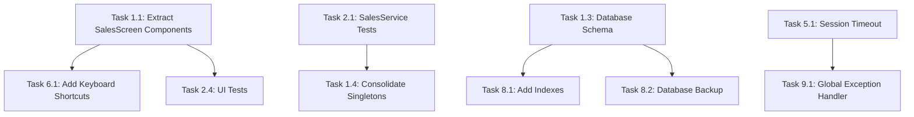

# Pasal POS - Autonomous Agent Task List

> **Generated**: 2026-01-21  
> **Codebase Location**: `/Users/sanjog/projects/retail_solutions/product/mobile/pos-system`  
> **Tech Stack**: Java 17, JavaFX 21, Spring Boot 3.2, H2 Database, Maven

This document contains detailed, actionable tasks for autonomous agents to execute. Each task includes context, files involved, acceptance criteria, and verification steps.

---

## Task Categories

1. [Code Quality & Refactoring](#1-code-quality--refactoring)
2. [Test Coverage](#2-test-coverage)
3. [Documentation](#3-documentation)
4. [Performance Optimization](#4-performance-optimization)
5. [Security Improvements](#5-security-improvements)
6. [UI/UX Enhancements](#6-uiux-enhancements)
7. [Sync & Networking](#7-sync--networking)
8. [Database Improvements](#8-database-improvements)
9. [Error Handling](#9-error-handling)
10. [Feature Enhancements](#10-feature-enhancements)

---

## 1. Code Quality & Refactoring

### Task 1.1: Extract UI Components from SalesScreen

**Priority**: High  
**Complexity**: Large  
**Estimated Time**: 4-6 hours

**Context**:  
`SalesScreen.java` is 3,471 lines - the largest file in the codebase. This violates Single Responsibility Principle and makes maintenance difficult.

**Files Involved**:

- `src/main/java/com/pos/ui/SalesScreen.java` (3,471 lines)
- Create new files in `src/main/java/com/pos/ui/components/`

**Detailed Steps**:

1. **Analyze SalesScreen structure** by viewing its outline (98 methods identified)
2. **Extract Receipt Panel** - Methods `createReceiptPanel()`, `createReceiptHeader()`, `createReceiptContent()`, `updateReceiptDateTime()` → New class `ReceiptPanelComponent.java`
3. **Extract Cart/Items Table** - Methods `setupCartColumns()`, cart-related functionality → New class `CartTableComponent.java`
4. **Extract Department/Product Grid** - Methods `createCategoryProductPanel()`, `createCenterContent()` → New class `ProductGridComponent.java`
5. **Extract Quick Actions Strip** - Method `createQuickActionsStrip()` → New class `QuickActionsComponent.java`
6. **Extract Totals Area** - Method `createTotalsArea()` → New class `TotalsSummaryComponent.java`
7. **Update SalesScreen** to compose these components
8. **Ensure WebSocket listeners** are properly delegated to child components

**Acceptance Criteria**:

- [ ] SalesScreen.java reduced to <500 lines
- [ ] Each extracted component is self-contained
- [ ] All existing functionality preserved
- [ ] No regression in UI behavior
- [ ] Application compiles with `mvn compile`
- [ ] Application runs with `mvn javafx:run`

**Verification**:

```bash
# Compile and verify no errors
cd /Users/sanjog/projects/retail_solutions/product/mobile/pos-system
mvn clean compile

# Run application and test sales screen functionality
mvn javafx:run
```

---

### Task 1.2: Extract Payment Panels from PaymentScreen

**Priority**: High  
**Complexity**: Medium  
**Estimated Time**: 3-4 hours

**Context**:  
`PaymentScreen.java` is 2,321 lines with multiple payment method panels. Each payment method (Cash, Card, EBT, Split) should be its own component.

**Files Involved**:

- `src/main/java/com/pos/ui/PaymentScreen.java` (2,321 lines)
- Create new files in `src/main/java/com/pos/ui/components/payment/`

**Detailed Steps**:

1. **Create base interface** `PaymentPanelComponent` with common methods
2. **Extract Cash Panel** - `createCashPaymentPanel()`, `handleCashKeypadInput()` → `CashPaymentPanel.java`
3. **Extract Card Panel** - `createCardPaymentPanel()` → `CardPaymentPanel.java`
4. **Extract EBT Panel** - `createEbtPaymentPanel()` → `EbtPaymentPanel.java`
5. **Extract Split Payment Panel** - `createSplitPaymentPanel()`, split-related methods → `SplitPaymentPanel.java`
6. **Create PaymentPanelFactory** to manage panel creation
7. **Update PaymentScreen** to use factory and components

**Acceptance Criteria**:

- [ ] PaymentScreen.java reduced to <800 lines
- [ ] Each payment type is a separate component
- [ ] Common styling shared via base class/interface
- [ ] Split payment calculations remain accurate
- [ ] Application compiles and runs

**Verification**:

```bash
mvn clean compile
mvn javafx:run
# Test: Navigate to payment screen, test each payment method
```

---

### Task 1.3: Refactor DatabaseManager Schema Initialization

**Priority**: Medium  
**Complexity**: Medium  
**Estimated Time**: 2-3 hours

**Context**:  
`DatabaseManager.java` has `initializeSchema()` method spanning ~1,170 lines (line 84-1255). This should be broken into smaller, table-specific methods or use migration files.

**Files Involved**:

- `src/main/java/com/pos/database/DatabaseManager.java` (1,939 lines)
- Create `src/main/resources/db/migrations/` directory

**Detailed Steps**:

1. **Create migration directory** structure under resources
2. **Extract table creation** statements into individual SQL files:
   - `V001_create_products.sql`
   - `V002_create_departments.sql`
   - `V003_create_sales.sql`
   - `V004_create_employees.sql`
   - etc.
3. **Create SchemaManager** class to load and execute migrations
4. **Implement version tracking** table for migrations
5. **Update DatabaseManager** to use SchemaManager
6. **Test backward compatibility** with existing databases

**Acceptance Criteria**:

- [ ] Schema SQL separated into individual migration files
- [ ] Migration version tracking implemented
- [ ] DatabaseManager.initializeSchema() under 100 lines
- [ ] Existing databases continue to work
- [ ] New databases initialize correctly

**Verification**:

```bash
# Delete existing database and test fresh initialization
rm -f ./data/posdb.mv.db
mvn clean compile
mvn javafx:run
# Verify tables are created correctly
```

---

### Task 1.4: Consolidate Service Layer Singletons

**Priority**: Low  
**Complexity**: Medium  
**Estimated Time**: 2-3 hours

**Context**:  
All 35 services use singleton pattern with `getInstance()`. Consider using dependency injection or a service locator pattern for better testability.

**Files Involved**:

- All files in `src/main/java/com/pos/service/` (35 files)
- Create `src/main/java/com/pos/service/ServiceRegistry.java`

**Detailed Steps**:

1. **Create ServiceRegistry** class as central service locator
2. **Define service interfaces** for major services (SalesService, InventoryService, etc.)
3. **Update services** to register with ServiceRegistry
4. **Update consumers** to obtain services from registry instead of static getInstance()
5. **Add lazy initialization** support in registry
6. **Document service dependencies**

**Acceptance Criteria**:

- [ ] ServiceRegistry provides centralized service access
- [ ] Services can be mocked for testing
- [ ] Existing functionality unchanged
- [ ] Circular dependency detection added

---

## 2. Test Coverage

### Task 2.1: Create Unit Tests for SalesService

**Priority**: Critical  
**Complexity**: Large  
**Estimated Time**: 6-8 hours

**Context**:  
Currently only `DiscountReproducer.java` exists as a test file. `SalesService.java` (1,522 lines) handles critical business logic including sale processing, tax calculations, and split payments.

**Files Involved**:

- `src/main/java/com/pos/service/SalesService.java`
- Create `src/test/java/com/pos/service/SalesServiceTest.java`

**Detailed Steps**:

1. **Set up test infrastructure** with JUnit 4 (already in pom.xml)
2. **Create mock objects** for DatabaseManager and ApiClient
3. **Test sale processing**:
   - `testProcessSale_SingleItem_CashPayment()`
   - `testProcessSale_MultipleItems_WithDiscount()`
   - `testProcessSale_SplitPayment()`
   - `testProcessSale_EbtPayment_NoTax()`
4. **Test tax calculations**:
   - `testCalculateTax_WithTaxableItems()`
   - `testCalculateTax_WithEbtExemption()`
   - `testCalculateTax_MixedItems()`
5. **Test GPI/surcharge calculations**:
   - `testCalculateGPI_CardPayment()`
   - `testCalculateGPI_CashPayment_NoSurcharge()`
6. **Test inventory deduction**:
   - `testDeductStockForSale()`
   - `testDeductStock_OutOfStock()`
7. **Test offline sync queue**:
   - `testStoreSaleLocally()`
   - `testMarkSaleAsSynced()`

**Acceptance Criteria**:

- [ ] Minimum 80% code coverage for SalesService
- [ ] All edge cases for payment types covered
- [ ] Tests run with `mvn test`
- [ ] Tests are isolated (no database side effects)

**Verification**:

```bash
mvn test -Dtest=SalesServiceTest
mvn test  # Run all tests
```

---

### Task 2.2: Create Unit Tests for ReportService

**Priority**: High  
**Complexity**: Medium  
**Estimated Time**: 3-4 hours

**Context**:  
`ReportService.java` handles financial reporting which is critical for business operations. Recent conversation history shows multiple report-related bugs.

**Files Involved**:

- `src/main/java/com/pos/service/ReportService.java` (21,675 bytes)
- Create `src/test/java/com/pos/service/ReportServiceTest.java`

**Detailed Steps**:

1. **Create test class** with setup for mock database
2. **Test daily summary**:
   - `testGetDailySummary_ValidDate()`
   - `testGetDailySummary_NoSales()`
   - `testGetDailySummary_WithRefunds()`
3. **Test gross/net sales calculations**:
   - `testGrossSales_IncludesTax()`
   - `testNetSales_ExcludesGPI()`
4. **Test decimal precision**:
   - `testMonetaryValues_TwoDecimalPlaces()`

**Acceptance Criteria**:

- [ ] Financial calculations verified with known inputs
- [ ] Decimal precision enforced (2 decimal places)
- [ ] Edge cases handled (no sales, refunds only)

---

### Task 2.3: Create Integration Tests for Sync Layer

**Priority**: Medium  
**Complexity**: Large  
**Estimated Time**: 5-6 hours

**Context**:  
The sync layer (`SyncManager`, `WebSocketClient`, inbound/outbound handlers) is complex and critical for multi-device operation.

**Files Involved**:

- `src/main/java/com/pos/sync/SyncManager.java`
- `src/main/java/com/pos/sync/WebSocketClient.java`
- `src/main/java/com/pos/sync/inbound/*.java`
- `src/main/java/com/pos/sync/outbound/*.java`
- Create `src/test/java/com/pos/sync/SyncIntegrationTest.java`

**Detailed Steps**:

1. **Create mock WebSocket server** for testing
2. **Test connection handling**:
   - `testWebSocketConnection_Success()`
   - `testWebSocketConnection_Reconnect()`
   - `testWebSocketConnection_OfflineMode()`
3. **Test inbound sync**:
   - `testProductSync_NewProducts()`
   - `testProductSync_UpdatedProducts()`
   - `testUserSync()`
4. **Test outbound sync**:
   - `testSalesOutbound_WhenOnline()`
   - `testSalesOutbound_QueuedWhenOffline()`
   - `testShiftOutbound()`

---

### Task 2.4: Create UI Tests for Critical Flows

**Priority**: Medium  
**Complexity**: Large  
**Estimated Time**: 6-8 hours

**Context**:  
JavaFX UI tests require TestFX framework. Critical flows include login, sales, payment, and reporting.

**Files Involved**:

- `pom.xml` - Add TestFX dependency
- Create `src/test/java/com/pos/ui/` directory

**Detailed Steps**:

1. **Add TestFX dependency** to pom.xml:
   ```xml
   <dependency>
       <groupId>org.testfx</groupId>
       <artifactId>testfx-junit</artifactId>
       <version>4.0.18</version>
       <scope>test</scope>
   </dependency>
   ```
2. **Create base test class** with JavaFX initialization
3. **Test login flow**:
   - `testLogin_ValidCredentials()`
   - `testLogin_InvalidCredentials()`
4. **Test sales flow**:
   - `testAddItemToCart()`
   - `testRemoveItemFromCart()`
   - `testApplyDiscount()`
5. **Test payment flow**:
   - `testCashPayment()`
   - `testChangeCalculation()`

---

## 3. Documentation

### Task 3.1: Generate JavaDoc for Public APIs

**Priority**: Medium  
**Complexity**: Small  
**Estimated Time**: 2-3 hours

**Context**:  
Many public methods lack JavaDoc comments. Key services and models should be documented.

**Files Involved**:

- All service classes in `src/main/java/com/pos/service/`
- All model classes in `src/main/java/com/pos/model/`

**Detailed Steps**:

1. **Add JavaDoc to service methods** with:
   - @param descriptions
   - @return descriptions
   - @throws for exceptions
2. **Add class-level documentation** describing purpose
3. **Configure Maven JavaDoc plugin**:
   ```xml
   <plugin>
       <groupId>org.apache.maven.plugins</groupId>
       <artifactId>maven-javadoc-plugin</artifactId>
       <version>3.6.3</version>
   </plugin>
   ```
4. **Generate documentation**: `mvn javadoc:javadoc`

---

### Task 3.2: Create Architecture Documentation

**Priority**: Medium  
**Complexity**: Small  
**Estimated Time**: 1-2 hours

**Context**:  
The codebase has complex sync architecture that should be documented for new developers.

**Files Involved**:

- Create `docs/ARCHITECTURE.md`

**Detailed Steps**:

1. **Document layer structure**:
   - UI Layer (JavaFX)
   - Service Layer
   - Sync Layer (WebSocket + REST)
   - Database Layer (H2)
2. **Create data flow diagrams** using Mermaid
3. **Document sync directions**:
   - Inbound: Backend → Local (Products, Users, Settings)
   - Outbound: Local → Backend (Sales, Shifts, Expenses)
4. **Document offline-first behavior**

---

## 4. Performance Optimization

### Task 4.1: Optimize Product Grid Loading

**Priority**: Medium  
**Complexity**: Small  
**Estimated Time**: 2 hours

**Context**:  
Product grid in SalesScreen loads all products at once. For stores with many products, this can be slow.

**Files Involved**:

- `src/main/java/com/pos/ui/SalesScreen.java`
- `src/main/java/com/pos/service/SalesService.java`

**Detailed Steps**:

1. **Implement virtualized grid** using `VirtualFlow` or `FlowPane` with lazy loading
2. **Add pagination** to `getProductsByDepartment()` method
3. **Cache product images** to avoid reloading
4. **Use background threads** for loading with `Task<>`

---

### Task 4.2: Add Database Connection Pooling

**Priority**: Medium  
**Complexity**: Small  
**Estimated Time**: 1-2 hours

**Context**:  
Current `DatabaseManager.getConnection()` creates new connections. For high-volume operations, a connection pool improves performance.

**Files Involved**:

- `pom.xml` - Add HikariCP dependency
- `src/main/java/com/pos/database/DatabaseManager.java`

**Detailed Steps**:

1. **Add HikariCP dependency**:
   ```xml
   <dependency>
       <groupId>com.zaxxer</groupId>
       <artifactId>HikariCP</artifactId>
       <version>5.1.0</version>
   </dependency>
   ```
2. **Configure connection pool** in DatabaseManager
3. **Replace `getConnection()`** to use pool
4. **Add pool monitoring** via JMX

---

## 5. Security Improvements

### Task 5.1: Implement Session Timeout

**Priority**: High  
**Complexity**: Small  
**Estimated Time**: 1-2 hours

**Context**:  
Based on conversation history, session expiration issues have been reported. Implement proper session timeout with user notification.

**Files Involved**:

- `src/main/java/com/pos/service/UserAuthService.java`
- `src/main/java/com/pos/ui/LoginScreen.java`
- `src/main/java/com/pos/config/ConfigManager.java`

**Detailed Steps**:

1. **Add session timeout configuration** in `application.properties`
2. **Create SessionManager** class to track activity
3. **Implement activity tracking** in UI views
4. **Show warning dialog** before timeout
5. **Auto-logout** on timeout
6. **Preserve unsaved work** before logout

---

### Task 5.2: Encrypt Sensitive Configuration

**Priority**: Medium  
**Complexity**: Small  
**Estimated Time**: 1-2 hours

**Context**:  
`application.properties` contains API keys and database credentials in plain text.

**Files Involved**:

- `src/main/resources/application.properties`
- `src/main/java/com/pos/config/ConfigManager.java`

**Detailed Steps**:

1. **Implement encryption utility** for sensitive values
2. **Encrypt API key and secret**
3. **Update ConfigManager** to decrypt on read
4. **Store encryption key** securely (not in repo)

---

## 6. UI/UX Enhancements

### Task 6.1: Add Keyboard Shortcuts

**Priority**: Low  
**Complexity**: Small  
**Estimated Time**: 2 hours

**Context**:  
Power users benefit from keyboard shortcuts for common operations.

**Files Involved**:

- `src/main/java/com/pos/ui/SalesScreen.java`
- `src/main/java/com/pos/ui/PaymentScreen.java`

**Detailed Steps**:

1. **Define shortcuts**:
   - F1: Help
   - F2: Pay
   - F3: Void Last
   - F4: Hold Sale
   - F5: Recall Sale
   - Esc: Cancel/Back
2. **Implement keyboard event handler**
3. **Add shortcut hints** to button labels
4. **Document shortcuts** in Help screen

---

### Task 6.2: Improve Error Messages

**Priority**: Medium  
**Complexity**: Small  
**Estimated Time**: 1-2 hours

**Context**:  
Error messages should be user-friendly and actionable.

**Files Involved**:

- `src/main/java/com/pos/util/ErrorHandler.java`
- `src/main/java/com/pos/util/DialogHelper.java`

**Detailed Steps**:

1. **Categorize errors** (Network, Database, Business Logic)
2. **Create user-friendly messages** for each category
3. **Add recovery suggestions** where applicable
4. **Log technical details** separately for debugging

---

## 7. Sync & Networking

### Task 7.1: Add Sync Conflict Resolution

**Priority**: Medium  
**Complexity**: Large  
**Estimated Time**: 4-5 hours

**Context**:  
When same data is modified on multiple devices, conflicts can occur. Implement proper conflict resolution.

**Files Involved**:

- `src/main/java/com/pos/sync/SyncManager.java`
- Create `src/main/java/com/pos/sync/ConflictResolver.java`

**Detailed Steps**:

1. **Define conflict types**:
   - Product price conflicts
   - Stock level conflicts
   - User permission conflicts
2. **Implement resolution strategies**:
   - Last-write-wins (default)
   - Server-wins (for critical data)
   - Merge (for additive changes)
3. **Add conflict logging**
4. **Create admin UI** for manual resolution

---

### Task 7.2: Implement Retry with Exponential Backoff

**Priority**: Medium  
**Complexity**: Small  
**Estimated Time**: 1-2 hours

**Context**:  
Current retry logic uses fixed delays. Exponential backoff is more appropriate for network operations.

**Files Involved**:

- `src/main/java/com/pos/api/ApiClient.java`
- `src/main/java/com/pos/sync/WebSocketClient.java`

**Detailed Steps**:

1. **Create RetryPolicy class** with exponential backoff
2. **Configure max retries** and initial delay
3. **Apply to API calls** in ApiClient
4. **Apply to WebSocket reconnection**

---

## 8. Database Improvements

### Task 8.1: Add Database Indexes

**Priority**: Medium  
**Complexity**: Small  
**Estimated Time**: 1 hour

**Context**:  
Frequently queried columns should have indexes for better performance.

**Files Involved**:

- `src/main/java/com/pos/database/DatabaseManager.java`

**Detailed Steps**:

1. **Identify frequent queries** (sales by date, products by department)
2. **Add indexes**:
   ```sql
   CREATE INDEX idx_sales_created_at ON sales(created_at);
   CREATE INDEX idx_products_department ON products(department_id);
   CREATE INDEX idx_products_barcode ON products(barcode);
   CREATE INDEX idx_sales_items_sale_id ON sale_items(sale_id);
   ```
3. **Test query performance** improvement

---

### Task 8.2: Implement Database Backup

**Priority**: High  
**Complexity**: Medium  
**Estimated Time**: 2-3 hours

**Context**:  
Local H2 database should have automatic backup to prevent data loss.

**Files Involved**:

- `src/main/java/com/pos/database/DatabaseManager.java`
- Create `src/main/java/com/pos/service/BackupService.java`

**Detailed Steps**:

1. **Create BackupService** with scheduled backups
2. **Implement backup method** using H2's BACKUP command
3. **Configure backup schedule** (daily, before EOD)
4. **Implement backup rotation** (keep last 7 days)
5. **Add restore functionality**
6. **Add UI for manual backup/restore**

---

## 9. Error Handling

### Task 9.1: Implement Global Exception Handler

**Priority**: High  
**Complexity**: Small  
**Estimated Time**: 1-2 hours

**Context**:  
Uncaught exceptions should be handled gracefully without crashing the application.

**Files Involved**:

- `src/main/java/com/pos/PosApplication.java`
- `src/main/java/com/pos/util/ErrorHandler.java`

**Detailed Steps**:

1. **Set up Thread.UncaughtExceptionHandler**
2. **Log errors** with full stack trace
3. **Show user-friendly dialog**
4. **Offer to restart application**
5. **Create error report** for support

---

### Task 9.2: Add Network Error Recovery

**Priority**: Medium  
**Complexity**: Medium  
**Estimated Time**: 2-3 hours

**Context**:  
Network operations should handle errors gracefully and queue for retry.

**Files Involved**:

- `src/main/java/com/pos/api/ApiClient.java`
- `src/main/java/com/pos/sync/SyncManager.java`

**Detailed Steps**:

1. **Categorize network errors** (timeout, connection refused, server error)
2. **Implement queuing** for retryable operations
3. **Add UI indicators** for offline mode
4. **Auto-retry** when connection restored

---

## 10. Feature Enhancements

### Task 10.1: Complete Multi-Store Support

**Priority**: Medium  
**Complexity**: Large  
**Estimated Time**: 6-8 hours

**Context**:  
README mentions multi-store support as a planned feature. Implement proper store switching and data isolation.

**Files Involved**:

- `src/main/java/com/pos/service/StoreService.java`
- `src/main/java/com/pos/config/ConfigManager.java`
- Multiple service files

**Detailed Steps**:

1. **Add store_id** to all relevant database tables
2. **Implement store switching** without re-registration
3. **Add UI for store selection**
4. **Isolate data per store**
5. **Sync store-specific settings**

---

### Task 10.2: Add Receipt Templates

**Priority**: Low  
**Complexity**: Medium  
**Estimated Time**: 3-4 hours

**Context**:  
README mentions receipt templates as a planned feature. Allow customization of receipt layout.

**Files Involved**:

- `src/main/java/com/pos/service/ReceiptPDFService.java`
- Create `src/main/resources/templates/`

**Detailed Steps**:

1. **Define template format** (JSON or XML)
2. **Create default templates**:
   - Standard receipt
   - Gift receipt
   - Duplicate receipt
3. **Implement template parser**
4. **Add UI for template management**
5. **Support logo images**

---

## Quick Reference - Command Verification

```bash
# Compile project
cd /Users/sanjog/projects/retail_solutions/product/mobile/pos-system
mvn clean compile

# Run all tests
mvn test

# Run specific test class
mvn test -Dtest=SalesServiceTest

# Run application
mvn javafx:run

# Generate JavaDoc
mvn javadoc:javadoc

# Package application
mvn clean package

# Check for dependency updates
mvn versions:display-dependency-updates
```

---

## Task Dependencies



---

## Summary Statistics

| Category             | Count  | Total Estimated Hours |
| -------------------- | ------ | --------------------- |
| Code Quality         | 4      | 11-16                 |
| Test Coverage        | 4      | 20-26                 |
| Documentation        | 2      | 3-5                   |
| Performance          | 2      | 3-4                   |
| Security             | 2      | 2-4                   |
| UI/UX                | 2      | 3-4                   |
| Sync & Networking    | 2      | 5-7                   |
| Database             | 2      | 3-4                   |
| Error Handling       | 2      | 3-5                   |
| Feature Enhancements | 2      | 9-12                  |
| **Total**            | **24** | **62-87**             |
